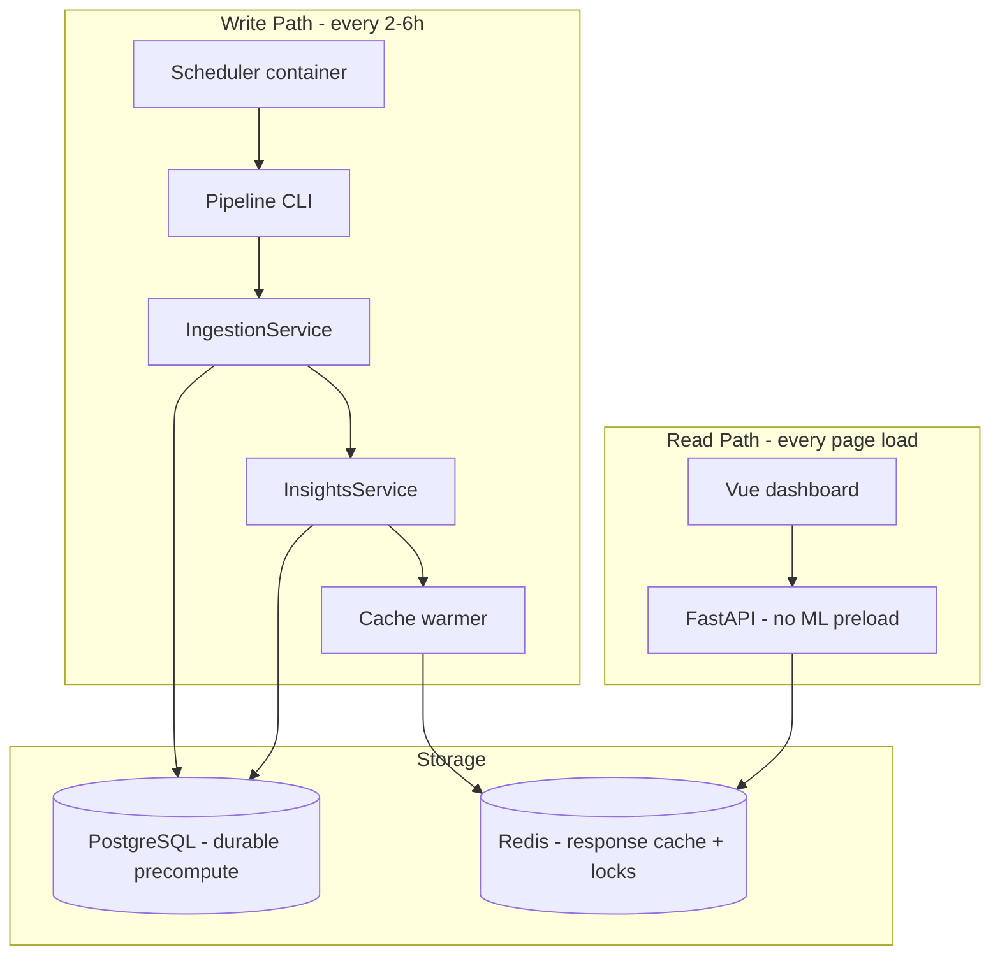

# Architecture Review: Celery vs Scheduler + Cache Pipeline

## Verdict

**Celery is not necessary for this use case.** Your proposed architecture is correct and aligns with how the codebase is already structured. Celery today is orchestration glue around existing services — not the source of parallelism or ML capability.

Keep Celery only if you later need: many independent concurrent jobs, horizontal worker autoscaling, complex per-job status across a fleet, or queue backpressure under bursty user-triggered load. None of those are core requirements for a dashboard that reads precomputed data refreshed every few hours.

---

## What Celery Actually Does Today (Evidence)

In [backend/app/tasks.py](backend/app/tasks.py), both tasks are ~15-line wrappers:

```python
# Effectively: open DB session → Service.run_job() → release lock
IngestionService(db).run_job(job_id)
InsightsService(db).run_job(job_id)
```

Celery provides:
- Async dispatch from `POST /api/ingest` and `POST /api/insights/run`
- 3 retries with 30s / 2m / 8m backoff
- Soft time limits (30m ingest, 60m insights)
- A separate `worker` container with `--concurrency=1`

All heavy work lives in [backend/app/services/](backend/app/services/) (`IngestionService`, `InsightsService`, ML sub-services). PostgreSQL already stores durable precomputed results (`sentiment_analyses`, `conversation_metrics`, `question_clusters`, `unanswered_questions`). Redis only caches two read endpoints today ([backend/app/api/insights.py](backend/app/api/insights.py) lines 79–99) with a 300s TTL and invalidate-on-complete — not proactive warming.

**Key observation:** With `concurrency=1`, Celery is not providing useful parallelism. It is a process supervisor + message queue for user-triggered jobs. That is overkill when the primary requirement is periodic cache refresh.

---

## Why Celery Is Overengineering Here

| Your requirement | What Celery adds | Simpler alternative |
|------------------|------------------|---------------------|
| Refresh data every 2–6h | Broker, worker process, task serialization | Cron / supercronic + `python -m app.pipeline run` |
| Fast frontend reads | Nothing (reads already bypass Celery) | Warm Redis after pipeline; cache-only GETs (503 on miss) |
| No ML in request path | Already true for API (`PRELOAD_MODELS=false`) | Keep API lean; run ML only in scheduler container |
| Parallel preprocessing | Not provided at `concurrency=1` | `ProcessPoolExecutor`, batched HF inference inside pipeline |
| Retries on failure | `self.retry()` | Inline retry loop in pipeline (port existing backoff) |
| Prevent overlapping runs | Redis locks already exist | Reuse [backend/app/locks.py](backend/app/locks.py) with `pipeline` lock kind |

### Common misconceptions (your reasoning is correct)

1. **FastAPI async does not make request-time ML acceptable.** Async helps I/O-bound handlers; sentiment/clustering/embeddings are CPU/GPU-bound and would block the event loop or require fragile `run_in_executor` patterns in every endpoint.

2. **Celery is not what makes Python parallel.** Parallelism belongs inside the pipeline (multiprocessing, vectorized ops, batched model inference). Celery distributes *tasks across workers* — useless when you intentionally run one heavy job at a time.

3. **A job queue is not a scheduler.** Celery can be scheduled via beat, but that adds broker + beat process + task visibility complexity when a crontab entry calling a CLI script achieves the same outcome with one log stream and one exit code.

4. **The frontend needs a fast read path, not live job execution.** Today [frontend/src/pages/RunPage.vue](frontend/src/pages/RunPage.vue) + WebSocket progress exists because jobs are user-triggered. For a cache-first dashboard, `completed_at` from job tables is sufficient metadata.

### Operational costs of keeping Celery

- Extra container ([docker-compose.yml](docker-compose.yml) `worker` service)
- 4 Redis logical DBs (broker, results, cache, pub/sub) vs 2 (cache + locks)
- Failure modes: stale tasks in broker, worker OOM restarts, `control.ping()` false negatives in [backend/app/api/health.py](backend/app/api/health.py)
- Debugging split across `api` logs and `worker` logs for what is logically one batch job

---

## When Celery Would Become Justified

Reintroduce a queue only if requirements change to:

- **Many agents** firing independent jobs concurrently with per-agent SLA
- **User-triggered** long runs at scale (queue backpressure, fair scheduling)
- **Heterogeneous job types** with different workers, priorities, and retry policies
- **Horizontal autoscaling** of workers separately from API replicas
- **Complex DAGs** (job B depends on job A across agents)

Your stated goal (scheduled refresh, stale OK, fast reads) does not hit this threshold.

---

## Recommended Target Architecture



PostgreSQL is **write-path only** from the API's perspective. The API never queries PG for dashboard reads.

### Design rules

**Write path (scheduler container)**
- `APP_ROLE=scheduler`, `PRELOAD_MODELS=true`, shared `hf_cache` volume
- Entry: `python -m app.pipeline run --agent-id=...` (new file per [docs/cron-cache-architecture.md](docs/cron-cache-architecture.md))
- Sequence per agent: acquire lock → ingest → insights → warm cache → release lock
- Inline retries (port from [backend/app/tasks.py](backend/app/tasks.py))
- Log to stdout; update `ingestion_jobs` / `insights_jobs` for audit

**Read path (API container) — cache-only, no DB fallback**
- Unchanged URLs and response shapes for [frontend/src/pages/ResultsPage.vue](frontend/src/pages/ResultsPage.vue) when cache is warm
- Every dashboard GET reads **only** from Redis; on cache miss return `503 Service Unavailable` with a clear message (e.g. `"Dashboard data not ready — pipeline has not warmed cache yet"`)
- **Remove** the current read-through pattern in [backend/app/api/insights.py](backend/app/api/insights.py) (`cache_get` → `service.get_*()` → `cache_set`); handlers must not call service/DB methods on miss
- No `.delay()`, no HF preload, no background tasks in handlers
- A cache miss means something went wrong (pipeline failed, warming skipped, TTL expired without refresh) — acceptable for an internal dashboard

**Interval strategy (per your input)**
- Default configurable cron (e.g. `PIPELINE_CRON="0 */2 * * *"` for 2h)
- **Overlap guard is critical** because Momants fetch is slow: Redis lock skips if previous run still active
- Effective max frequency = pipeline duration (if ingest+insights takes 90m, 2h cron means ~30m idle; a 2h job means back-to-back runs)
- `CACHE_TTL_SECONDS` = cron interval + buffer (e.g. 2h cron → 10800s TTL, or 1.5× interval)

**Manual refresh (simple path)**
- Optional `POST /api/pipeline/run` that spawns the same CLI via `subprocess` or runs pipeline in a FastAPI `BackgroundTasks` thread — **same code path as cron, no Celery**
- Keep only if trivial; otherwise defer and stay cron-only with `GET /api/ingest/latest` + `GET /api/insights/jobs/latest` for "last updated"

---

## Parallelism Without Celery

Keep **one pipeline run per agent** (same as today's `concurrency=1`). Parallelize inside phases:

| Phase | Strategy |
|-------|----------|
| Momants API fetch | Sequential (rate limits; this is your bottleneck) |
| Sentiment | Batched inference or `ProcessPoolExecutor` per conversation batch |
| Metrics | Batch DB reads, vectorized aggregates |
| Clustering / embeddings | Already batch-oriented |
| Intent / unanswered | Batch inference |

One process, one exit code, one log stream — significantly easier to reason about than Celery worker lifecycle.

---

## Concrete Implementation Plan (Incremental)

Leverage existing [docs/cron-cache-architecture.md](docs/cron-cache-architecture.md) — it is accurate and matches the codebase.

### Phase 1 — Pipeline CLI (no Celery removal yet)

Create [backend/app/pipeline.py](backend/app/pipeline.py):
- `run_pipeline(agent_id)` calling `IngestionService.run_job()` then `InsightsService.run_job()` directly
- Reuse `acquire_agent_job_lock(agent_id, "pipeline")` / `release_agent_job_lock`
- Port retry/backoff from `tasks.py`

Verify: `docker compose exec api python -m app.pipeline run --agent-id=<uuid>`

### Phase 2 — Cache warming + cache-only read endpoints

Create cache warmer (e.g. [backend/app/services/cache_warmer.py](backend/app/services/cache_warmer.py)):
- Warm: `overview`, `questions`, `unanswered`, `conversations:list`, and any other dashboard GET payloads (timeline, stats if used by ResultsPage)
- Warmer calls existing service methods **during the pipeline** (write path) to build payloads, then writes to Redis — services stay the source of serialization logic, but API handlers never invoke them on read
- Call at end of pipeline; change insights completion from invalidate-only to warm
- Refactor all dashboard GET handlers to: `cache_get(key)` → return payload, or `HTTPException(503)` on miss — **no** `service.get_*()` fallback
- Raise `CACHE_TTL_SECONDS` to match cron interval; pipeline must refresh before TTL expiry

### Phase 3 — Scheduler container

Replace `worker` with `scheduler` in [docker-compose.yml](docker-compose.yml):
- `supercronic /app/crontab` or loop+sleep
- `APP_ROLE=scheduler`, `PRELOAD_MODELS=true`
- Cron loops `SCHEDULED_AGENT_IDS` from [backend/app/config.py](backend/app/config.py)
- Run **alongside** Celery initially for safe cutover

### Phase 4 — Frontend + API demotion

- [frontend/src/pages/ResultsPage.vue](frontend/src/pages/ResultsPage.vue): on `503` from any insight/conversation GET, show a warning banner (e.g. "Dashboard data unavailable — waiting for pipeline refresh") instead of partial/empty charts; do not retry aggressively
- [frontend/src/pages/RunPage.vue](frontend/src/pages/RunPage.vue): show "Last updated" from job timestamps; optional manual refresh button
- [frontend/src/api/client.js](frontend/src/api/client.js): surface `503` distinctly so pages can branch to warning state
- Demote or remove `POST /api/ingest` / `POST /api/insights/run` Celery dispatch
- [backend/app/api/health.py](backend/app/api/health.py): replace `celery_app.control.ping()` with last successful job timestamps + optional scheduler heartbeat Redis key; add `cache_ready` flag per agent (all expected keys present)

### Phase 5 — Remove Celery

Delete: [backend/app/worker.py](backend/app/worker.py), [backend/app/tasks.py](backend/app/tasks.py), `celery[redis]` from [backend/requirements.txt](backend/requirements.txt)
Simplify Redis: drop broker (DB 0) and result backend (DB 1); keep cache + locks
Optional cleanup: [backend/app/pubsub.py](backend/app/pubsub.py), [backend/app/api/ws.py](backend/app/api/ws.py) if live progress is no longer needed

---

## What Stays Unchanged

No rewrites needed for the valuable parts:

- [backend/app/services/ingestion_service.py](backend/app/services/ingestion_service.py)
- [backend/app/services/insights_service.py](backend/app/services/insights_service.py)
- All ML services under [backend/app/services/](backend/app/services/)
- [backend/app/cache.py](backend/app/cache.py) (extend, don't replace)
- [backend/app/locks.py](backend/app/locks.py)
- PostgreSQL schema and job audit tables
- Frontend read endpoints in [frontend/src/api/client.js](frontend/src/api/client.js)

---

## Trade-offs to Accept

| Gain | Cost |
|------|------|
| Simpler ops (2 containers fewer concepts) | Data freshness = cron interval (2–6h stale) |
| Predictable read latency (always Redis) | No live progress bar during runs |
| Single debuggable batch log | Failed run waits for next cron unless manual refresh added |
| API stays stateless and fast — zero DB/ML on reads | Dashboard shows warning until cache is warm; no degraded DB fallback |
| Clear failure signal (503 = pipeline problem) | Cold start / first deploy shows empty dashboard until first pipeline completes |

---

## Summary

Your architecture instinct is sound. Celery was a reasonable choice for the **current** UX (user clicks "Run", watches WebSocket progress), but it is the wrong abstraction for the **target** UX (always-fast dashboard, periodic refresh). The migration is low-risk because services already encapsulate all business logic — you are swapping the trigger mechanism and completing the cache layer, not rewriting ML.

**Recommended default:** scheduler + pipeline CLI + cache warming + **cache-only** FastAPI reads (503 on miss, warning in UI). Defer Celery unless job-queue requirements emerge later.
